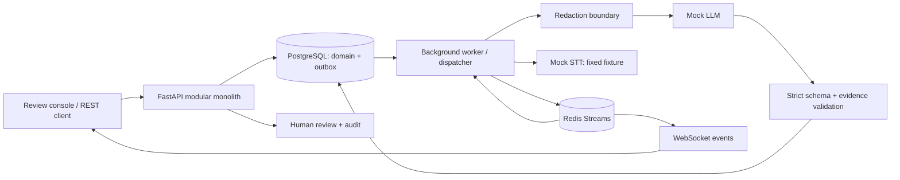
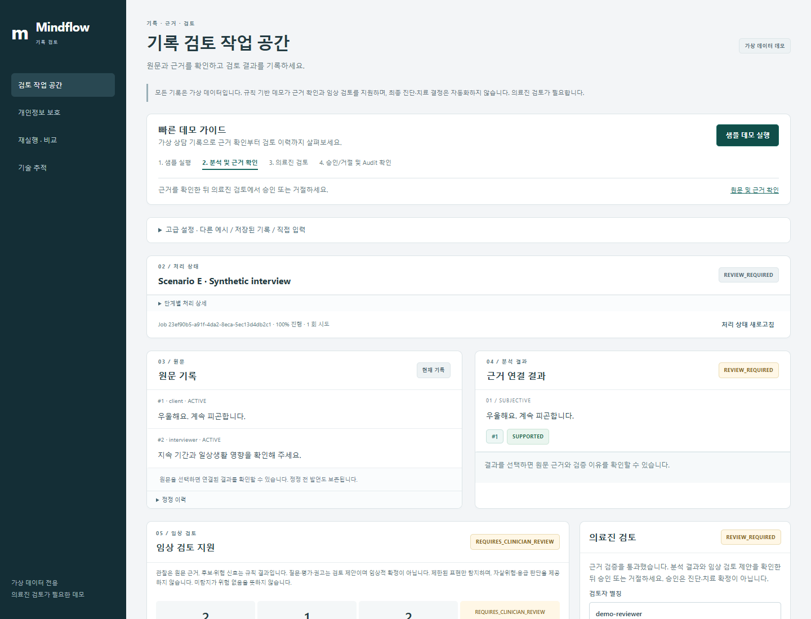
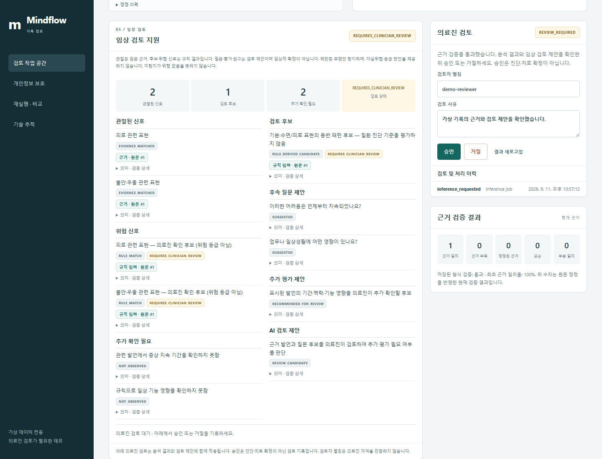

# Mindflow Inference

Mindflow Inference is a traceable AI inference backend for behavioral-health documentation, designed so generated statements can be traced to source evidence, validated, reviewed, and reproduced.

**상담·인터뷰 기록의 근거성, 추적성, 재현성을 다루는 백엔드 포트폴리오.** 모든 기본 실행은 명시적인 deterministic mock provider와 synthetic data를 사용합니다. 본 데모는 상담 기록의 구조화, 근거 검증, 위험 신호 확인 및 임상 검토 지원을 위한 포트폴리오 시스템입니다. AI는 임상 판단 후보와 추가 확인 항목을 제시할 수 있지만, 최종 진단 및 치료 결정은 자동화하지 않으며 의료진 검토를 필요로 합니다. 모든 데이터는 가상 데이터입니다.

## Clinical Review Support

Worker가 redacted input snapshot에 `clinical-rules-v1`을 적용하여 관찰 표현, 검토할 위험 신호, 동반 표현 패턴 후보, 규칙으로 확인하지 못한 정보, 후속 질문, 추가 평가 및 검토 권고 후보를 생성합니다. 화면의 Clinical Review Support 패널에서 Transcript 참조를 클릭하면 원문과 검증 이유를 확인할 수 있습니다. Scenario A는 수면·피로·기능 어려움, Scenario E는 기분·피로 동반 표현을 보여줍니다. 탐지된 표현이 없는 경우 항목을 임의로 채우지 않습니다.

`SUPPORTED`는 **규칙 적용 및 원문 연결**이 검증되었다는 뜻입니다. 질환, 위험도 또는 권고의 임상적 타당성·확률을 의미하지 않습니다. 가능한 condition은 질환명이 아닌 동반 표현 패턴 후보로 제한합니다. 한국어 일부 문구와 부정·과거·타인 발언 제외 규칙만 지원하며, 부정/맥락을 완전하게 이해하지 않습니다. 탐지 결과가 없다는 것이 위험이 없다는 뜻은 아닙니다. 자살위험 평가, 응급 분류, 진단 기준 평가, 약물·처방 및 치료 결정은 구현하지 않습니다.

화면에서는 내부 `validation`과 항목의 의미를 구분합니다. Observed signals는
`EVIDENCE_MATCHED`, condition candidates는 `RULE_DERIVED_CANDIDATE`, risk signals는
`RULE_MATCH`, missing information은 `NOT_OBSERVED`, 후속 질문은 `SUGGESTED`,
추가 평가는 `RECOMMENDED_FOR_REVIEW`, 권고는 `REVIEW_CANDIDATE`로 표시합니다.
관찰 근거와 후보/위험 규칙의 입력 출처만 Transcript 버튼으로 표시하며, 누락 정보와
질문·평가·권고에는 출처 버튼을 붙이지 않습니다. 저장된 참조는 내부 규칙 문맥 및 정정
검사 용도로 보존합니다. 검증 실패·오래된 근거는 별도 경고로 표시하고 승인 차단을
유지합니다. 긴 검증 설명은 각 항목의 상세 보기에 있습니다.

Clinical 항목은 기존 exact-source Evidence Validator와 규칙 일치 검증을 통과해야 하며, 근거가 없거나 허용된 규칙과 다르면 `UNSUPPORTED`입니다. 기존 Human Review API가 note와 clinical support를 함께 승인/반려하고 같은 note audit에 검토자와 결정을 기록합니다. 어느 쪽이든 현재 근거가 지원되지 않으면 승인을 차단합니다. 승인은 검토 기록이지 진단·치료 확정이 아닙니다. Reviewer는 demo alias이며 의료진 자격을 인증하지 않습니다.

Clinical 결과는 기존 run의 PostgreSQL JSONB provider metadata에 저장됩니다. GET에서 현재 규칙으로 과거 결과를 재생성하지 않습니다. run ID, provider/model, rule version, 시간, evidence 및 최초 validation을 보존하고 현재 정정 상태와 reviewer/review status를 함께 반환합니다. 정정은 기존 승인을 무효화하며 clinical evidence도 `STALE_EVIDENCE`로 표시합니다. Replay는 기존 immutable input을 사용하되 실행 시 규칙 버전을 새 결과에 기록합니다. 이전 run에 clinical snapshot이 없으면 `clinical_support: null`이며 replay로 생성할 수 있습니다. DB migration은 추가로 필요하지 않습니다.

## Problem & differentiation

유효한 JSON을 생성했다고 신뢰할 수 있는 기록이 되는 것은 아닙니다. 원문에 없는 주장, 정정 이전 발화의 인용, 모델·프롬프트 변경 후 결과 차이를 backend에서 추적해야 합니다.

- **Evidence binding:** 모든 statement에 원문 sequence와 검증 결과 저장.
- **Correction-aware evidence:** 명시적 `corrects` 관계, `STALE_EVIDENCE` 탐지, 과거 승인 무효화.
- **Human review gate:** 모든 결과는 `REVIEW_REQUIRED`; active evidence로 완전히 supported된 결과만 승인.
- **Trace & replay:** 입력 스냅샷·해시·모델·프롬프트·latency·retry 기록, 동일 입력 재실행/비교.
- **Real async infrastructure:** PostgreSQL transactional outbox → Redis Streams consumer group → worker → Redis events → WebSocket.

## Architecture



하나의 코드베이스, API 프로세스와 worker 프로세스. Redis는 실제 job 전달과 event 전달을 담당합니다. PostgreSQL이 상태의 source of truth이며 DB outbox가 publish 실패를 복구합니다.

## Render deployment configuration

Render용 [Blueprint](render.yaml)와 [배포 안내](docs/render-deployment.md)를 제공합니다.
공개 Live Demo URL은 아직 검증되지 않았습니다. 현재 직접 입력/업로드가 원문을 저장하므로,
공개 방문자의 개인정보 저장을 금지하는 요구사항을 충족하기 전에는 Blueprint를 적용하지 마세요.
기존 [Demo Video](docs/demo.mp4)와 [GitHub source](https://github.com/sokldjs554/mindflow-inference)는 계속 이용할 수 있습니다.

## Docker quick start

필수: Docker Engine/Desktop + Compose v2. 외부 AI API key는 필요 없습니다.

```sh
docker compose up --build -d
docker compose exec api python -m scripts.demo
```

콘솔: **http://localhost:8000** · OpenAPI: **http://localhost:8000/docs** · readiness: `/ready`.

`migrate`가 Alembic migration을 완료한 뒤 API와 worker가 시작됩니다. PostgreSQL/Redis 데이터는 named volume에 유지됩니다. 포트는 localhost에만 바인딩합니다. Compose의 DB 암호는 로컬 데모용 공개 값입니다. 공개 서비스에는 별도 secrets와 인증 설계가 필요합니다.

## 빠른 데모 — 처음 사용하는 경우

1. 상단 **샘플 데모 실행**을 누릅니다. 설정 없이 Scenario E의 가상 기록을 생성하고 분석합니다.
2. **원문 기록 / 근거 연결 결과**의 근거 버튼을 눌러 출처를 확인합니다.
3. **임상 검토 지원**의 후보와 제안을 확인하고 **의료진 검토**에서 승인 또는 거절합니다.
4. **검토 및 처리 이력 (Audit)**에서 검토자·결정·처리 시각을 확인합니다.

빠른 데모 가이드는 현재 화면의 처리·근거 확인·검토 상태에 맞춰 다음 행동을 안내합니다.
이는 화면 탐색 안내이며 의료진 검토를 대신하거나 추가 승인 조건을 만들지 않습니다.

[](docs/demo.mp4)

[데모 영상 보기](docs/demo.mp4)

가상 상담 기록을 이용해 근거 확인 · 임상 검토 지원 · 의료진 검토 · 검토 이력 · 재실행 흐름을 보여주는 데모입니다.



**고급 설정**에는 다른 시나리오, 저장된 기록·실행, 직접 입력과 접근 키가 있습니다.
재실행·개인정보 보호·Technical Trace는 아래 접힌 영역이나 왼쪽 탐색 메뉴에서 열 수 있습니다.

정정 및 replay를 확인하려면 **고급 설정 → B · 발언 정정과 재실행 → 예시 실행**을 선택합니다.
#10의 네 시간 진술이 #12의 여섯 시간으로 정정되고, note-v1의 `STALE_EVIDENCE`가
승인을 차단하는 것을 확인합니다. **재실행 · 이전 결과와 비교**를 펼쳐 note-v2로
재실행한 뒤 실제 비교 수치와 근거를 확인하고 승인할 수 있습니다.

다른 시나리오: A 정상 근거 연결, C 근거 없는 주장 삽입·탐지, D 이름·주소·연락처 치환. Mock 모델은 발화를 복사하는 baseline이며 실제 LLM 품질을 보여주는 데모가 아닙니다. Audio Mock STT는 WAV 내용을 인식하지 않고 고정 synthetic transcript를 반환합니다.

## Local development (Python 3.12)

PostgreSQL 16과 Redis 7.4 이상을 실행합니다. Docker가 있으면 의존성만 시작할 수 있습니다:

```sh
docker compose up -d postgres redis
```

Windows CMD:

```bat
python -m venv .venv
.venv\Scripts\activate.bat
python -m pip install -e ".[dev]"
copy .env.example .env
alembic upgrade head
uvicorn app.main:app --no-access-log
```

별도 CMD에서:

```bat
.venv\Scripts\activate.bat
python -m app.worker
```

세 번째 CMD에서 `python -m scripts.demo`를 실행합니다.

PowerShell (activation policy 변경 없이):

```powershell
python -m venv .venv
.venv\Scripts\python -m pip install -e '.[dev]'
Copy-Item .env.example .env
.venv\Scripts\alembic upgrade head
.venv\Scripts\uvicorn app.main:app --no-access-log
# Separate terminals:
.venv\Scripts\python -m app.worker
.venv\Scripts\python -m scripts.demo
```

Unix/macOS/Linux:

```sh
python3.12 -m venv .venv
. .venv/bin/activate
python -m pip install -e '.[dev]'
cp .env.example .env
alembic upgrade head
uvicorn app.main:app --no-access-log
# Separate terminals, with the same virtualenv:
python -m app.worker
python -m scripts.demo
```

## Tech stack

Python 3.12 · FastAPI · Pydantic v2 · SQLAlchemy 2 async · asyncpg · Alembic · PostgreSQL · Redis Streams · REST/HTTP · WebSocket · Docker Compose · pytest/httpx · Ruff · strict mypy · Prometheus metrics · GitHub Actions configuration.

## REST API

| Method | Path | Purpose |
|---|---|---|
| POST / GET | `/api/sessions` | Create / keyset-paginated list |
| GET | `/api/sessions/{id}` | Session and original transcript |
| POST | `/api/sessions/{id}/transcript` | Append utterances / explicit corrections |
| POST | `/api/sessions/{id}/audio` | PCM WAV upload, <=5 MB / 120 s |
| POST | `/api/sessions/{id}/inferences` | Queue inference; `Idempotency-Key` required |
| GET | `/api/jobs/{id}` | State, attempts, safe error code |
| GET | `/api/jobs/{id}/result` | Validated note and provenance |
| GET | `/api/sessions/{id}/runs` | Keyset-paginated runs |
| GET | `/api/runs/{id}` / `/evidence` | Statements, source links, validation |
| POST | `/api/runs/{id}/reviews` | `approve` or `reject`, reviewer alias, reason |
| POST | `/api/runs/{id}/replay` | Immutable-input replay; idempotency required |
| GET | `/api/comparisons?original=...&replay=...` | Same-input comparison |
| GET | `/api/audit/{resource_id}` | Latest 100 audit entries |

Unified errors: `{"error":{"code":"UNSAFE_APPROVAL","message":"...","request_id":"..."}}`.
`API_KEY` is read from the process environment by both the API and `scripts/demo.py`. Putting it in `.env` works for the API because its settings load that file; a shell-launched script must receive it in its process environment (for example `set API_KEY=...` in CMD or `$env:API_KEY='...'` in PowerShell). It is a shared demo boundary, not tenant authentication. Reviewer names are aliases, not independently verified identities.

## Inference pipeline & WebSocket

`QUEUED → INGESTING → [TRANSCRIBING] → REDACTING → GENERATING → VALIDATING → REVIEW_REQUIRED → COMPLETED` (human approve/reject). The dispatcher republishes unfinished jobs after 30 seconds to recover lost Redis job streams. Acknowledged messages are deleted. Failed attempts retry with bounded exponential backoff; invalid output schema fails immediately. Exhausted jobs become `FAILED`.

Connect `ws://localhost:8000/ws/jobs/{job_id}`. If API key is configured, send `{"api_key":"..."}` as the first frame within five seconds. Keys are not placed in URL query strings. Initial DB snapshot is followed by Redis event messages:

```json
{"type":"progress","job_id":"<uuid>","state":"GENERATING","progress":60,"timestamp":"...","event_id":"<uuid>","cursor":"..."}
```

Heartbeat every 10 idle seconds; disconnect cancels Redis polling. Reconnect obtains current DB state. Event delivery is at least once; consumers can deduplicate `event_id`. Event streams expire after 24 hours; durable events remain in PostgreSQL.

## Evidence, review & privacy boundary

`SUPPORTED`, `PARTIALLY_SUPPORTED`, `UNSUPPORTED`, `CONTRADICTED`, `STALE_EVIDENCE` are implemented. The conservative baseline checks reference existence, supersession, explicit Korean duration disagreement, exact source match and excerpts. It does **not** prove arbitrary paraphrase entailment. Only `SUPPORTED` active evidence can be approved; no override route is provided.

Redaction replaces demo Korean names followed by 씨, selected city/district patterns, phone numbers, emails and resident-ID patterns before LLM invocation. Mapping exists only in memory and is discarded; provider input and stored generated results are redacted. This is a limited deterministic boundary, **not comprehensive PII/PHI detection**. Original transcripts/audio remain in restricted logical tables in PostgreSQL; encryption/retention/tenant access controls require deployment work. Do not upload real patient data.

## Provenance, prompt versioning & replay

Version catalog is immutable through the public API. note-v1 retains historical statements; note-v2 uses active statements. Each run records SHA-256 input hashes, redacted snapshot, model and prompt versions, template hash, schema version, timing, retry count and provider/validator metadata. Replay uses the original persisted input snapshot, not the latest transcript. Comparison requires equal original-input hash and session, and reports supported-statement coverage, unsupported/contradiction/stale counts, schema validity and measured attempt latency. Historical validation remains immutable; `current_validation` accounts for later corrections.

## Testing

Create a **dedicated** `mindflow_test` PostgreSQL database. Integration tests refuse database names not ending in `_test`; they truncate that test schema and clear only the `mindflow-test:*` Redis namespace.

```sh
docker compose exec postgres createdb -U mindflow mindflow_test
python -m pytest -q
ruff check app tests scripts
ruff format --check app tests scripts
mypy app
```

Defaults: test PostgreSQL localhost:5432/mindflow_test; Redis localhost:6379/15. Override with `TEST_DATABASE_URL` / `TEST_REDIS_URL`. Unit-only: `python -m pytest tests/test_evidence.py -q`. Tests cover real PostgreSQL constraints/rollback, Redis consumer recovery, live WebSocket with worker events, retry/timeout/schema failure, redaction, replay, review and idempotency races.

## Operations, database & performance

`/health` is process liveness; `/ready` checks DB migration table and Redis with a deadline. `/metrics` exports process-local HTTP/inference latency, failures, validation statuses and WebSocket connections. Worker metrics are exported separately at `http://localhost:9000/metrics`; scrape each worker and aggregate externally. The worker exporter has no API-key authentication and is bound to loopback by default (Compose publishes only on loopback). Logs use an allowlist of IDs/states/codes, never transcript/provider exception text. Request IDs are UUID-validated; Redis rate limiting is per direct client IP (120 requests/minute by default).

A reproducible 200,000-row synthetic EXPLAIN ANALYZE measurement and raw plans are recorded in the performance document. Composite cursor indexes, a partial review index and batch evidence loading avoid offset scans and N+1. See [database](docs/database.md), [performance](docs/performance.md), [architecture](docs/architecture.md), [pipeline](docs/inference-pipeline.md), [evidence validation](docs/evidence-validation.md).

## AWS-ready architecture

Planned ALB → ECS/Fargate API + worker, RDS PostgreSQL, ElastiCache Redis, S3, Secrets Manager and CloudWatch mapping: [deployment architecture](docs/aws-architecture.md). No AWS deployment is claimed.

## Verification & limitations

Local verification details, commands and environment: [verification report](docs/verification.md). CI configuration is not a claim that hosted Actions have passed. Docker is unavailable in this environment; container build and Compose execution remain unverified. Native PostgreSQL/Redis integration and browser demo results are recorded separately.

Scope intentionally excludes diagnostic inference and treatment decisions, real transcription, production tenancy/authentication, comprehensive entity redaction, retention automation and external AI adapters. Mock semantic rules have limited language coverage. Audio is bounded and stored in DB for this portfolio; larger production objects belong in object storage. Future work: semantic-validator evaluation corpus, private STT, OIDC/RBAC, retention/encryption, queue retention and deployment hardening. No benchmark or deployment performance claims without measurements.

### Synthetic load test

Run the bounded end-to-end harness with the API and worker running:

```powershell
.venv\Scripts\python -m scripts.load_test --environment "local API + worker, PostgreSQL 16.4, Redis 8.10.1" --jobs 6 --concurrency 2 --output docs/load-test-results.json
```

The harness creates synthetic sessions, submits transcripts, dispatches jobs through Redis, observes WebSocket progress, retrieves results, and approves them. It reports measured client-side percentiles and throughput; it has no warm-up phase and never uses real behavioral-health data.
