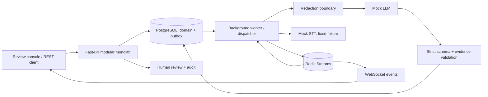

# Mindflow Inference

Mindflow Inference is a traceable AI inference backend for behavioral-health documentation, designed so generated statements can be traced to source evidence, validated, reviewed, and reproduced.

**상담·인터뷰 기록의 근거성, 추적성, 재현성을 다루는 백엔드 포트폴리오.** 모든 기본 실행은 명시적인 deterministic mock provider와 synthetic data를 사용합니다. 의료 진단, 치료 결정, 임상 의사결정 시스템이 아닙니다.

## Problem & differentiation

유효한 JSON을 생성했다고 신뢰할 수 있는 기록이 되는 것은 아닙니다. 원문에 없는 주장, 정정 이전 발화의 인용, 모델·프롬프트 변경 후 결과 차이를 backend에서 추적해야 합니다.

- **Evidence binding:** 모든 statement에 원문 sequence와 검증 결과 저장.
- **Correction-aware evidence:** 명시적 `corrects` 관계, `STALE_EVIDENCE` 탐지, 과거 승인 무효화.
- **Human review gate:** 모든 결과는 `REVIEW_REQUIRED`; active evidence로 완전히 supported된 결과만 승인.
- **Trace & replay:** 입력 스냅샷·해시·모델·프롬프트·latency·retry 기록, 동일 입력 재실행/비교.
- **Real async infrastructure:** PostgreSQL transactional outbox → Redis Streams consumer group → worker → Redis events → WebSocket.

## Architecture



하나의 코드베이스, API 프로세스와 worker 프로세스. Redis는 실제 job 전달과 event 전달을 담당합니다. PostgreSQL이 상태의 source of truth이며 DB outbox가 publish 실패를 복구합니다.

## Docker quick start

필수: Docker Engine/Desktop + Compose v2. 외부 AI API key는 필요 없습니다.

```sh
docker compose up --build -d
docker compose exec api python -m scripts.demo
```

콘솔: **http://localhost:8000** · OpenAPI: **http://localhost:8000/docs** · readiness: `/ready`.

`migrate`가 Alembic migration을 완료한 뒤 API와 worker가 시작됩니다. PostgreSQL/Redis 데이터는 named volume에 유지됩니다. 포트는 localhost에만 바인딩합니다. Compose의 DB 암호는 로컬 데모용 공개 값입니다. 공개 서비스에는 별도 secrets와 인증 설계가 필요합니다.

## 60-second demo

1. 콘솔에서 **B · Correction & prompt replay** → **Run scenario**.
2. #10의 네 시간 진술이 #12의 여섯 시간으로 정정됨을 확인.
3. note-v1의 `STALE_EVIDENCE`와 승인 차단 확인.
4. **Replay with note-v2** → active evidence만 사용한 결과와 실제 비교 수치 확인.
5. source reference를 클릭해 근거 확인 후 **Approve**.

다른 시나리오: A 정상 근거 연결, C 근거 없는 주장 삽입·탐지, D 이름·주소·연락처 치환. Mock 모델은 발화를 복사하는 baseline이며 실제 LLM 품질을 보여주는 데모가 아닙니다. Audio Mock STT는 WAV 내용을 인식하지 않고 고정 synthetic transcript를 반환합니다.

## Local development (Python 3.12)

PostgreSQL 16과 Redis 7.4 이상을 실행합니다. Docker가 있으면 의존성만 시작할 수 있습니다:

```sh
docker compose up -d postgres redis
```

Windows CMD:

```bat
python -m venv .venv
.venv\Scripts\activate.bat
python -m pip install -e ".[dev]"
copy .env.example .env
alembic upgrade head
uvicorn app.main:app --no-access-log
```

별도 CMD에서:

```bat
.venv\Scripts\activate.bat
python -m app.worker
```

세 번째 CMD에서 `python -m scripts.demo`를 실행합니다.

PowerShell (activation policy 변경 없이):

```powershell
python -m venv .venv
.venv\Scripts\python -m pip install -e '.[dev]'
Copy-Item .env.example .env
.venv\Scripts\alembic upgrade head
.venv\Scripts\uvicorn app.main:app --no-access-log
# Separate terminals:
.venv\Scripts\python -m app.worker
.venv\Scripts\python -m scripts.demo
```

Unix/macOS/Linux:

```sh
python3.12 -m venv .venv
. .venv/bin/activate
python -m pip install -e '.[dev]'
cp .env.example .env
alembic upgrade head
uvicorn app.main:app --no-access-log
# Separate terminals, with the same virtualenv:
python -m app.worker
python -m scripts.demo
```

## Tech stack

Python 3.12 · FastAPI · Pydantic v2 · SQLAlchemy 2 async · asyncpg · Alembic · PostgreSQL · Redis Streams · REST/HTTP · WebSocket · Docker Compose · pytest/httpx · Ruff · strict mypy · Prometheus metrics · GitHub Actions configuration.

## REST API

| Method | Path | Purpose |
|---|---|---|
| POST / GET | `/api/sessions` | Create / keyset-paginated list |
| GET | `/api/sessions/{id}` | Session and original transcript |
| POST | `/api/sessions/{id}/transcript` | Append utterances / explicit corrections |
| POST | `/api/sessions/{id}/audio` | PCM WAV upload, <=5 MB / 120 s |
| POST | `/api/sessions/{id}/inferences` | Queue inference; `Idempotency-Key` required |
| GET | `/api/jobs/{id}` | State, attempts, safe error code |
| GET | `/api/jobs/{id}/result` | Validated note and provenance |
| GET | `/api/sessions/{id}/runs` | Keyset-paginated runs |
| GET | `/api/runs/{id}` / `/evidence` | Statements, source links, validation |
| POST | `/api/runs/{id}/reviews` | `approve` or `reject`, reviewer alias, reason |
| POST | `/api/runs/{id}/replay` | Immutable-input replay; idempotency required |
| GET | `/api/comparisons?original=...&replay=...` | Same-input comparison |
| GET | `/api/audit/{resource_id}` | Latest 100 audit entries |

Unified errors: `{"error":{"code":"UNSAFE_APPROVAL","message":"...","request_id":"..."}}`.
Optional `API_KEY` environment setting requires `X-API-Key` for API/metrics; it is a shared demo boundary, not tenant authentication. Reviewer names are aliases, not independently verified identities.

## Inference pipeline & WebSocket

`QUEUED → INGESTING → [TRANSCRIBING] → REDACTING → GENERATING → VALIDATING → REVIEW_REQUIRED → COMPLETED` (human approve/reject). Failed attempts retry with bounded exponential backoff; invalid output schema fails immediately. Exhausted jobs become `FAILED`.

Connect `ws://localhost:8000/ws/jobs/{job_id}`. If API key is configured, send `{"api_key":"..."}` as the first frame within five seconds. Keys are not placed in URL query strings. Initial DB snapshot is followed by Redis event messages:

```json
{"type":"progress","job_id":"<uuid>","state":"GENERATING","progress":60,"timestamp":"...","event_id":"<uuid>","cursor":"..."}
```

Heartbeat every 10 idle seconds; disconnect cancels Redis polling. Reconnect obtains current DB state. Event delivery is at least once; consumers can deduplicate `event_id`. Event streams expire after 24 hours; durable events remain in PostgreSQL.

## Evidence, review & privacy boundary

`SUPPORTED`, `PARTIALLY_SUPPORTED`, `UNSUPPORTED`, `CONTRADICTED`, `STALE_EVIDENCE` are implemented. The conservative baseline checks reference existence, supersession, explicit Korean duration disagreement, exact source match and excerpts. It does **not** prove arbitrary paraphrase entailment. Only `SUPPORTED` active evidence can be approved; no override route is provided.

Redaction replaces demo Korean names followed by 씨, selected city/district patterns, phone numbers, emails and resident-ID patterns before LLM invocation. Mapping exists only in memory and is discarded; provider input and stored generated results are redacted. This is a limited deterministic boundary, **not comprehensive PII/PHI detection**. Original transcripts/audio remain in restricted logical tables in PostgreSQL; encryption/retention/tenant access controls require deployment work. Do not upload real patient data.

## Provenance, prompt versioning & replay

Version catalog is immutable through the public API. note-v1 retains historical statements; note-v2 uses active statements. Each run records SHA-256 input hashes, redacted snapshot, model and prompt versions, template hash, schema version, timing, retry count and provider/validator metadata. Replay uses the original persisted input snapshot, not the latest transcript. Comparison requires equal original-input hash and session, and reports supported-statement coverage, unsupported/contradiction/stale counts, schema validity and measured attempt latency. Historical validation remains immutable; `current_validation` accounts for later corrections.

## Testing

Create a **dedicated** `mindflow_test` PostgreSQL database. Integration tests refuse database names not ending in `_test`; they truncate that test schema and clear only the `mindflow-test:*` Redis namespace.

```sh
docker compose exec postgres createdb -U mindflow mindflow_test
python -m pytest -q
ruff check app tests scripts
ruff format --check app tests scripts
mypy app
```

Defaults: test PostgreSQL localhost:5432/mindflow_test; Redis localhost:6379/15. Override with `TEST_DATABASE_URL` / `TEST_REDIS_URL`. Unit-only: `python -m pytest tests/test_evidence.py -q`. Tests cover real PostgreSQL constraints/rollback, Redis consumer recovery, live WebSocket with worker events, retry/timeout/schema failure, redaction, replay, review and idempotency races.

## Operations, database & performance

`/health` is process liveness; `/ready` checks DB migration table and Redis with a deadline. `/metrics` exports process-local HTTP/inference latency, failures, validation statuses and WebSocket connections. Worker metrics need a worker scrape exporter for multi-process aggregation; see limitations. Logs use an allowlist of IDs/states/codes, never transcript/provider exception text. Request IDs are UUID-validated; Redis rate limiting is per direct client IP (120 requests/minute by default).

Composite cursor indexes, a partial review index and batch evidence loading avoid offset scans and N+1. See [database](docs/database.md), [performance](docs/performance.md), [architecture](docs/architecture.md), [pipeline](docs/inference-pipeline.md), [evidence validation](docs/evidence-validation.md).

## AWS-ready architecture

Planned ALB → ECS/Fargate API + worker, RDS PostgreSQL, ElastiCache Redis, S3, Secrets Manager and CloudWatch mapping: [deployment architecture](docs/aws-architecture.md). No AWS deployment is claimed.

## Verification & limitations

Local verification details, commands and environment: [verification report](docs/verification.md). CI configuration is not a claim that hosted Actions have passed. Docker runtime was absent in the initial local environment; build execution status is tracked separately.

Scope intentionally excludes clinical inference, real transcription, production tenancy/authentication, comprehensive entity redaction, retention automation and external AI adapters. Mock semantic rules have limited language coverage. Audio is bounded and stored in DB for this portfolio; larger production objects belong in object storage. Future work: semantic-validator evaluation corpus, private STT, OIDC/RBAC, retention/encryption, queue retention and deployment hardening. No benchmark or deployment performance claims without measurements.
