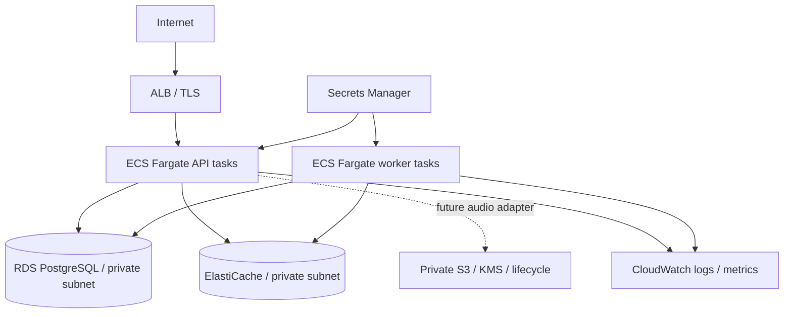

# AWS-ready architecture (design only)

No AWS resources have been deployed or applied. This is a deployment mapping with explicitly outstanding work, not a certified healthcare environment.

API and worker use the same image with different commands. A one-off migration task precedes rolling deploy. ALB readiness targets `/ready`; liveness targets `/health`. Use private subnets, restricted security-group paths, TLS DB/Redis connections, task-role secrets, no public database ports, authenticated metrics scraping and encrypted backups.

Sizing begins with one worker and measured connection budget: each active worker can use two DB connections (advisory lock + transactions). Scale API independently; test multi-worker dispatch under failure before scaling. ElastiCache must support Streams consumer groups and XAUTOCLAIM. Use persistence and noeviction for durable queue intent, while DB outbox remains authoritative.

The worker exports Prometheus metrics on port 9000; scrape each worker task separately
and aggregate in the monitoring system. Restrict this port to the metrics collector.
Acknowledged job messages are deleted; durable DB event retention remains a deployment concern.

Outstanding production changes: OIDC/RBAC and tenant ownership, retention/deletion and audit policy, complete redaction evaluation, raw audio boundary assessment, S3 adapter (current implementation stores bounded WAV in PostgreSQL), metrics collector configuration, disaster-recovery tests and load testing. Review aliases are not authenticated reviewer identities. Never expose the keyless local demo publicly.
