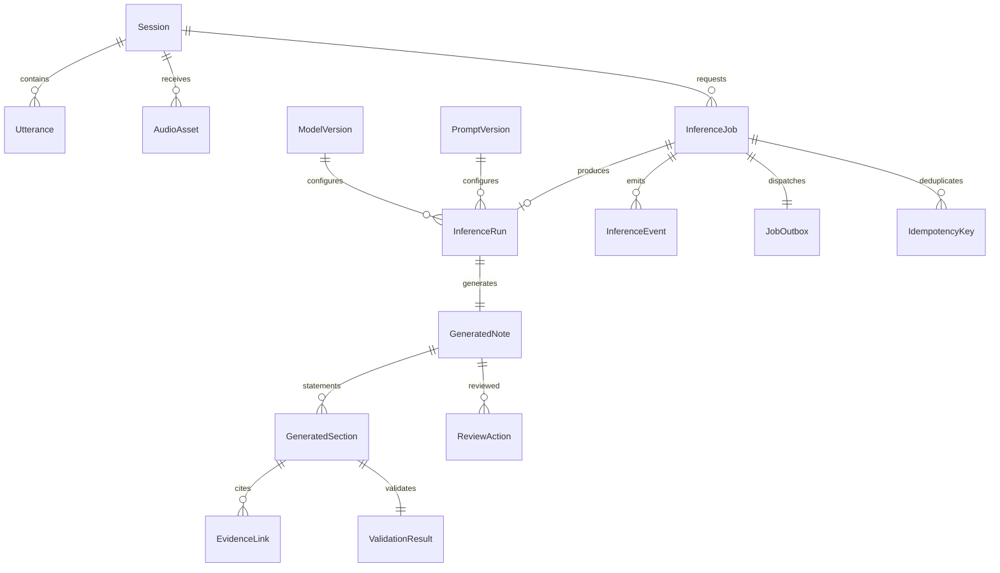

# Database

UUID keys, UTC-aware timestamps, PostgreSQL JSONB for immutable input snapshots and trace metadata. SQLAlchemy 2 async sessions use asyncpg; Alembic owns DDL.

GeneratedSection is a positioned statement in subjective/objective/plan. EvidenceLink retains claimed sequences even when nonexistent, allowing invalid references to be inspected. It therefore has no utterance FK; binding is against the immutable run snapshot, not a mutable current row. `AuditEvent` records resource UUID, action and safe metadata.

Session row locks serialize append/correction/snapshot/review operations. `(session_id, sequence)` uniqueness and increasing correction checks protect inputs. Idempotency key is globally unique; same-session requests are serialized, cross-session key reuse is rejected by unique constraint. Job/outbox/key/event are one transaction. Result/run/statements/validation/event are one transaction. Review/note/audit/event are one transaction.

Run lists use `(session_id, created_at, id)` index; sessions use `(created_at, id)`. Review queue partial index targets `status='REVIEW_REQUIRED'`. Result retrieval batches sections and evidence rather than lazy-loading each statement. Review locks session before note to use a consistent lock order with corrections.

Raw transcript/audio are persisted; redaction mapping is ephemeral. There are no deletion endpoints, tenant row policies, encrypted columns or retention jobs. Backups contain sensitive input if real data is introduced; use only synthetic data here.
